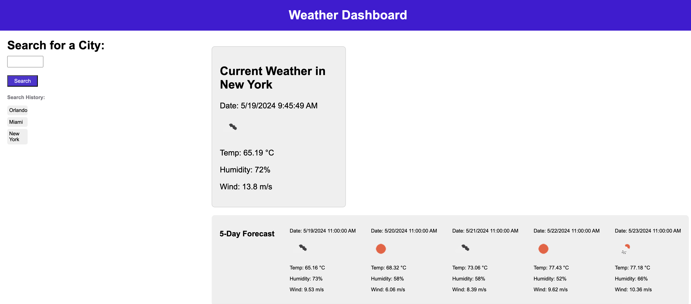

# weather-dashboard

## Discription

The purspose of this project is to get weather data by borrowing openweather.com's weather API. Once a city is is search, the current weather and a 5 day forecast should appear.

* Typing a city and clicking the search button should return the city's weather and 5 day forecast.

* A history of the cities searched should be looged and be selected once clicked on.

## Installation

Website:

https://jguzman87.github.io/weather-dashboard/

## Contact Information

Jorge Guzman
jguzman913@gmail.com